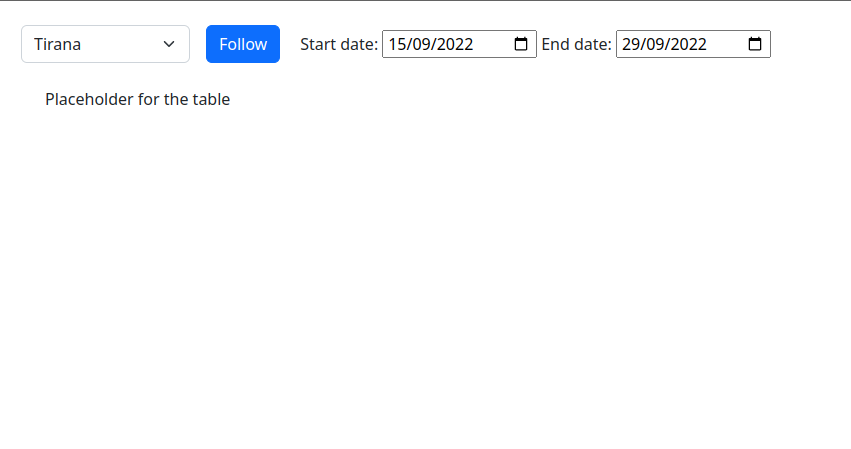

# Fullstack technical case

## Foreword

First of all congratulations on making it to the technical case stage of the Interview!
We are looking forward to seeing what you can do!
The goal of the case is to test your MVC knowledge, your problem-solving skills as well as how well you can integrate with an already existing code base.

Because of the nature of the position we are requiring you to use our tech stack ([Rails](https://rubyonrails.org/) and [React](https://Reactjs.org/)).
The Fullstack team at AppTweak acts as a bridge between the Frontend and the Backend teams so you will be using both depending on the squad's needs.

We will take this into account when reviewing the case, we don't expect you to excel at all aspects but some good bases and reflexes are important and this case represents the basics a full-stack dev will be doing daily at AppTweak.

You can find some useful resources here:\
[rails video tutorials](https://www.youtube.com/playlist?list=PLm8ctt9NhMNV75T9WYIrA6m9I_uw7vS56)\
[rails tutorial blog](https://guides.railsgirls.com/app)

Assume you are already working here:
 - use all documentation you can find online
 - if you have questions or if you feel like the instructions are not clear do not hesitate to get in touch with us. We will do our best to help (without giving you the solution of course :p)
## Case intro

The goal is to create a simple weather application that shows historical temperatures from a publicly available API.

We are providing you with a base Rails application. A React application will consume the data from this latter to display the views.
You can add, edit or delete anything you want for your solutions.
You are also allowed to use external libraries/gems.

Here is what the current interface looks like:



## API and data source
The data will be provided by an API object inside this boilerplate.
It is located under `app/objects/weather_api.rb` and contains a simple get method that returns the temperatures for a given latitude and longitude **for today**.

You are allowed to use any libraries you want **BUT** the data **MUST** come from this API object (you cannot use another publicly available API). This class has to remain unchanged.

We are not expecting you to add any more cities. Just use the ones provided by the DB when you do the initial setup.

## Frontend

In order to display the data, we created a small React application. This latter is served by Rails by using [react-rails](https://github.com/reactjs/react-rails). Hence, this provides a small Single Page Application responsible for fetching, storing, and displaying all the needed information based on React, Redux (we're using [redux-toolkit](https://redux-toolkit.js.org)), and [Redux-sagas](https://redux-saga.js.org). Note that all the frontend code is written in [TypeScript](https://www.typescriptlang.org).


## Your tasks
 - The user has to be able to follow/unfollow cities.
 - The app has to collect daily data through the weather api object and store it for all followed cities.
 - The user has to be be able to see all available data for the selected date range on a table.
 - When the user changes the selected city or daterange, the table has to change accordingly.
 - If the user requests data that is not available we expect you to gracefully handle it any way you see fit.

## Setup
As explained above, you will have to work on both the backend and frontend sides. Both parts are launched separately. Here are the instructions to install the dependencies and run the Rails and React apps.

- to install dependencies run:
```
bundle
```

- to setup the db just run the following:
```
bin/rails db:setup
```
this will setup an sqlite db and populate it with any required resource from the given seed file.

- to run the application run:
```
bin/rails server
```
this will run the server on http://127.0.0.1:3000

- (optional) to run purely the terminal server, you can run:
```
bin/rails console
```
this will open an IRB terminal where you can directly interact with rails.

- (optional) to run the tests/specs, use:
```
bin/rails test
```

- to install all the frontend dependencies run:
```
npm install
```
this will install all the npm packages needed to run the React application.

- to launch the React app, run the `webpack-dev-server` in a new terminal:
```
./bin/webpack-dev-server
```
this will start the webpack server that will serve the frontend and automatically reload the page when you make changes in the code related to React.

## Additional info

You do not need to worry about security, sign-in etc.
Assume there is only one user that uses this app and that there is simply no login.

We recommend you use ruby 3.1.0 and node 16.17.0 .

Remember that we prefer you focus on providing a well-organized and clean code instead of adding many things that were not asked and rushing the implementation.
